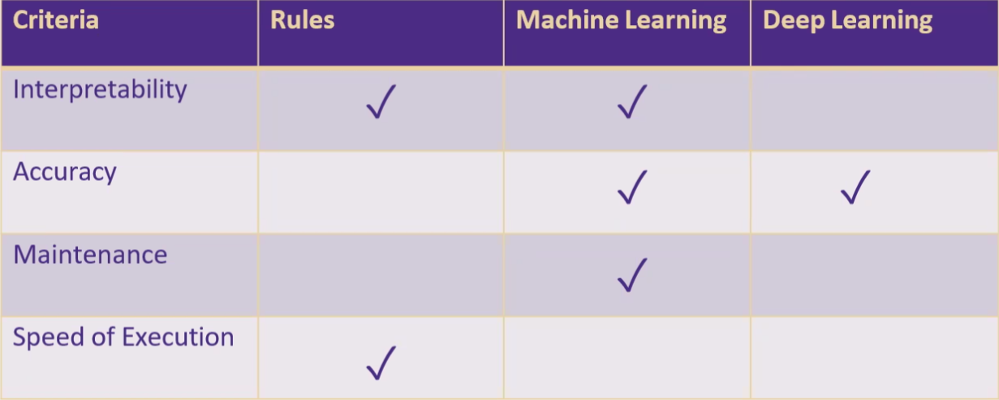

* Artificial Intelligence
	* Machines capable of mimicking human behavior
* Machine Learning
	* Machines capable of learning from experience
* Data Science
	* Business application of ML, AI, and other quantitative fields like statistics

## Machine Learning

**What is Machine Learning?** A computer program is said to learn from experience E with respect to some class of tasks T and performance measure P if its performance on T, as measured  by P improves the experience E.

**Ex:** Spam Filter

* Email is spam or ham? (Task T)
* Processing emails for spam or ham (Experience E)
* Percentage of emails correctly classified as spam or ham (Performance P)

**As we see more examples, our ability to classify them improves.**

* ML Model Training
	* Training Datasets are fed to a Machine Learning Algorithm to build a Prediction Model.
* ML Model Serving
	* Query Instances into the Prediction Model to return a Prediction
	
Prediction cannot be pushed back into the model without validation otherwise it would be a self-fulfilling prophecy.

**When to use AI/ML types?**

----
## Supervised Learning

Learn to predict an output from input using a **labeled** dataset.

* Linear/logistic regression
* K Nearest-Neighbors (First Assignment)
* Decision Tree
* Random Forest
* Gradient Boosting Trees
* Support Vector Machines
* (Deep) Neural Networks
* Others...

Labeling is EXPENSIVE. Oftentimes these are predictive models defined by the input labeled data. Predicting the target based on input.

**Ex:** Predict Delivery Times for UberEats, Product Recommendations on Amazon, Housing Prices on Redfin or Zillow

**Terminology**
* Label
	* The outcome we are interested in predicting
	* Ex: House Prices, cat images, loan defaults
* Features
	* An input/transformed variable that is used to predict a label
	* Number of bedrooms, colors in pixels, monthly income
* Training
	* Using labeled data to iteratively learn the function that transofrms an input into output
* Inference
	* Using a trained model to make predictions on new data (unseen data)
* Performance
	* Mean Square Error, Precisions Recall, AUC

* Other details...[Review Slides]

----
## Unsupervised Learning

Find patterns and structure in an **unlabeled** dataset
* K-Means/KMedoids
* Hierarchical Clustering
* Gaussian Mixture Models
* Principal Component Analysis
* Anomaly Detection
* Autoencoders
* Others...

Often these are segmenting/classification problems or finding the input. No visibility into the target.

**Ex:** Grouping by advertising group, Geographical clusters, grouping neighborhoods or houses...

**Terminology**
* Regression
	* Predicting continuous value
	* House prices in Seattle?
	* Stock Prices
* Classification
	* Predicting Discrete values
	* Will this applicant default on a loan?
	* Is this image a cat, dog, scorpion, pigeon?

----
## Reinforcement Learning

 Has rewards. Think about playing a game.

**Ex**: Playing Starcraft, Chess, Go, Magic...

----
## Performance Measures and Metrics

**Classification Metrics**
* Error is when a record is assigned a class when it belongs to another class
* Type 1 Error: AKA False Negative
	* Positive class is assigned to a record when the true class is negative
* Type 2 Error: AKA False Negative
	* Negative class is assigned to a record when the true class is positive

**Confusion Matrix classification metrics**
	* Accuracy
		* Ratio of correctly predicted observation to the total observation
		* (TP+TN)/(TP + FP + TN + FN)
	* Precision
		* Ratio of true positives over all true and false positives
		* TP/(TP+FP) -> True Positives over (TP+False Positives)
	* Recall
		* Ratio of true positives over the sum of true positives and false negatives
		* TP/(TP+FN)

Assignment
Quiz
Discussion
Reading Materials